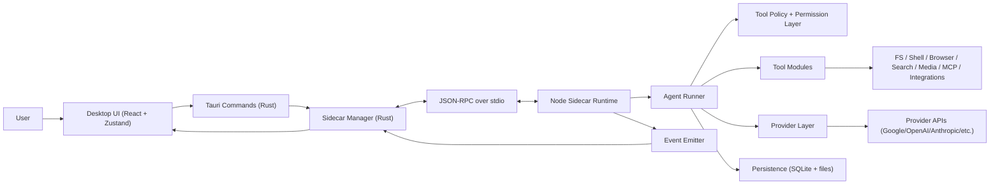
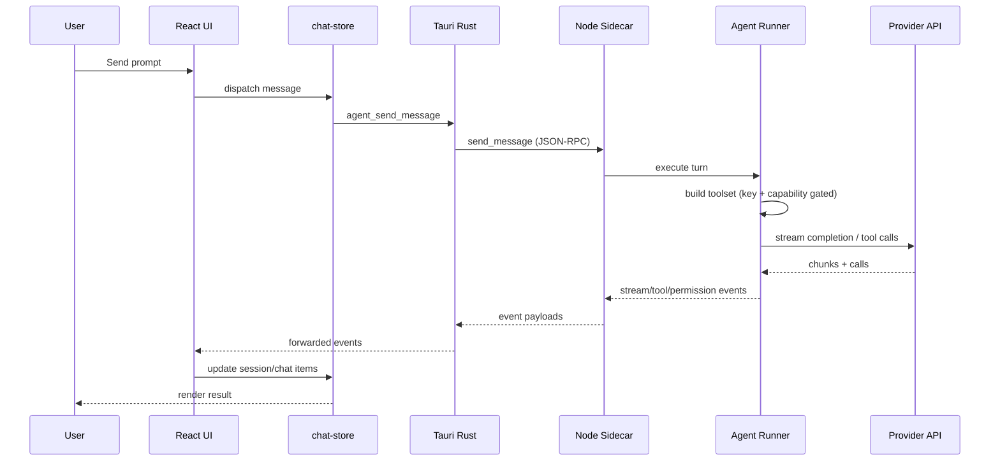
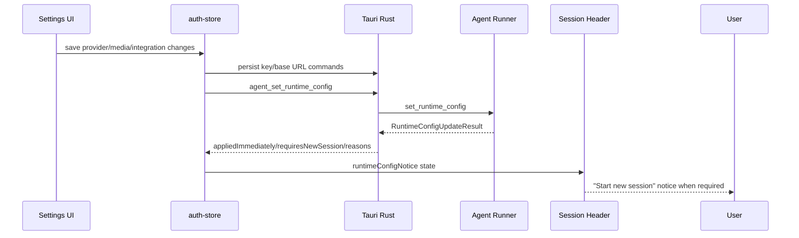

<p align="center">
  
</p>

<h1 align="center">Cowork</h1>

<p align="center">
  <strong>AI command center for coding, research, tools, and integrations</strong>
</p>

<p align="center">
  Multi-provider desktop app built with Tauri + React + TypeScript + a Node.js sidecar agent runtime.
</p>

---

## What You Get

Cowork combines chat, tool execution, browser automation, research, media generation, and integrations in one desktop workflow.

Current platform scope:

- 8 chat providers: Google, OpenAI, Anthropic, OpenRouter, Moonshot (Kimi), GLM, DeepSeek, LM Studio
- 8 messaging integrations: WhatsApp, Slack, Telegram, Discord, iMessage (BlueBubbles), Microsoft Teams, Matrix, LINE
- Unified web tools: `web_search` and `web_fetch` with provider-aware routing and fallback paths
- Unified media tools: `generate_image`, `edit_image`, `generate_video`, `analyze_video`
- `computer_use` browser automation with provider-aware routing
- `deep_research` long-form autonomous research flow
- 51 skills, 10 subagents, 23 connector configs, and 5 slash-command packs
- Session persistence, memory system, cron jobs, tool policies, permission gates

---

## Platform Highlights

### AI and Tooling

- Multi-provider chat with per-session provider + model
- Provider-aware web search routing with external fallbacks (Exa / Tavily / Google fallback path)
- Provider-aware web fetch routing (Anthropic web fetch, GLM web reader, Google URL-context fallback path)
- Provider-aware computer use (Google, OpenAI, Anthropic native paths; Google fallback for others when configured)
- Media backend routing independent from chat provider (Google / OpenAI / Fal)

### Product UX

- Provider-first onboarding
- 3 settings tabs:
  - Provider
  - Media
  - Integrations
- Command sandbox controls in Provider settings (mode, network, path scope, trusted commands, runtime/output limits)
- Session-level Plan Mode (`Plan` -> `<proposed_plan>` -> Accept/Reject -> auto-execute on accept)
- Runtime config apply pipeline with explicit "start new session" notice when changes cross compatibility boundaries

### Developer and Ops

- Tauri desktop shell with Rust command surface
- Node sidecar with JSON-RPC over stdio
- Zustand state stores with persisted settings/session metadata
- SQLite-backed persistence in sidecar storage layer

---

## Provider Capability Matrix

The table below describes current runtime behavior in this repository.

| Provider | Chat | Native Web Search Path | Native Web Fetch Path | Native Computer Use Path | Models API Path | Base URL Editable |
|---|---|---|---|---|---|---|
| Google | Yes | Yes | Yes (URL Context) | Yes | Yes | No |
| OpenAI | Yes | Yes | No (Google fallback path) | Yes | Yes | No |
| Anthropic | Yes | Yes | Yes | Yes | Yes | No |
| OpenRouter | Yes | No (fallback path) | No (Google fallback path) | No (Google fallback path) | Yes | Yes |
| Moonshot (Kimi) | Yes | Yes | No (Google fallback path) | No (Google fallback path) | Yes | Yes |
| GLM | Yes | Yes | Yes (web reader) | No (Google fallback path) | Curated fallback path by design | Yes |
| DeepSeek | Yes | No (fallback path) | No (Google fallback path) | No (Google fallback path) | Yes (curated fallback on endpoint failure) | Yes |
| LM Studio | Yes | No (fallback path) | No (Google fallback path) | No (Google fallback path) | Yes (curated fallback on endpoint failure) | Yes |

Notes:

- Media generation is not bound to chat provider. It is controlled by media backend settings.
- Tool availability is key-gated. Missing required keys means tools are not registered.

---

## Architecture

### System Diagram



### Message Flow



### Runtime Config Impact Flow



---

## Tooling Model (How Tools Are Registered)

Tool registration is dynamic and session-aware:

1. Build runtime context:
   - Active provider
   - Provider/API/fallback keys
   - Media routing and specialized model IDs
2. Compute capability gates:
   - Provider-native support
   - Key presence
   - Fallback availability
3. Register only eligible tools:
   - Ineligible tools are omitted (not registered)
4. Generate system prompt tool section from registered tools

This prevents "known missing key" runtime failures by avoiding registration when configuration is incomplete.

### Canonical Tool Names

- `web_search` (with compatibility alias `google_grounded_search`)
- `web_fetch`
- `generate_image`
- `edit_image`
- `generate_video`
- `analyze_video`
- `computer_use`
- `deep_research`
- plus file/system/integration tooling

---

## Onboarding and Settings

### Onboarding (Provider-first)

Required:

1. Name
2. Provider selection
3. Provider API key (optional for LM Studio)
4. Base URL for editable providers
5. Model selection (or custom model ID)

Optional:

- Media backend + key/model setup (Google/OpenAI/Fal)
- External search fallback config (Google/Exa/Tavily)
- Integration and capability keys (Stitch, etc.)

### Settings Tabs

1. **Provider**
   - Active provider
   - Provider key
   - Provider base URL (editable providers only)
2. **Media**
   - Image/video backend routing (Google/OpenAI/Fal)
   - Google/OpenAI/Fal media keys
   - Model overrides for image/video generation
3. **Integrations**
   - External search fallback provider + Exa/Tavily keys

## Plan Mode Workflow

Plan mode is a per-session analyze-only mode:

1. Switch the session header mode from `Execute` to `Plan`.
2. Agent investigates with read-only tool access and returns `<proposed_plan>...</proposed_plan>`.
3. Review the in-chat `Plan Approval` card:
   - `Accept and Execute`: switches to execute mode and auto-runs the approved plan.
   - `Reject and Revise`: keeps plan mode and requests a revised plan.

Plan mode tool behavior:

- Allowed: read tools, `web_search`, `web_fetch`, and safe read-only shell commands.
- Blocked: writes, destructive shell, scheduling, notifications, media generation, browser automation, and other side effects.

Execute mode discipline:

- Agent is expected to call `write_todos` early for multi-step work and continuously update todo statuses as execution progresses.
   - Stitch key
   - Specialized model overrides (`computer_use`, `deep_research`)
   - Messaging integration settings (WhatsApp/Slack/Telegram/Discord/iMessage/Teams)

### Runtime Apply Behavior

- Usually hot-applies:
  - key rotations
  - media backend/key/model changes
  - fallback search/integration key changes
- May require new session:
  - provider change
  - base URL change
  - chat model change

When required, UI surfaces a "Start new session" notice in chat header.

For deep onboarding/settings details, see:

- [docs/GET_STARTED.md](docs/GET_STARTED.md)

---

## Messaging Integrations (8 Platforms)

Cowork supports full shared-session ingress and outbound notification flows across:

- WhatsApp
- Slack
- Telegram
- Discord
- iMessage (BlueBubbles bridge; macOS host required)
- Microsoft Teams (Azure Graph app credentials)
- Matrix
- LINE

When a platform is connected:

- Inbound messages can trigger shared-session workflows.
- The canonical `message` tool is registered for rich channel operations (`send`, `search`, `read`, `edit`, `delete`, reactions, pins, threads, moderation) based on per-channel capabilities.
- Outbound notification tool is registered dynamically:
  - `send_notification_whatsapp`
  - `send_notification_slack`
  - `send_notification_telegram`
  - `send_notification_discord`
  - `send_notification_imessage`
  - `send_notification_teams`
  - `send_notification_matrix`
  - `send_notification_line`
- Attachment messages are normalized into the shared message model, with URL metadata fallback where raw bytes are unavailable.
- Integration hooks (active: `cron`, `path`, `integration_event`, and manual run-now) execute inside the integration subsystem and remain separate from MCP connectors.

Setup prerequisites:

- Discord: bot token, optional guild/channel allowlists, optional DM ingress.
- iMessage: BlueBubbles server URL + access token; unsupported on non-macOS hosts.
- Teams: tenant ID, client ID, client secret, team ID, channel ID.
- Matrix: homeserver URL + access token, optional default room.
- LINE: channel access token, optional default target.

---

## Model Catalog Strategy

Model listing is provider-aware and robust to endpoint gaps:

- API-first where stable
- Curated fallback for providers/endpoints that are unavailable or unreliable
- Custom model ID input always supported in UI

Current notable behavior:

- GLM uses curated catalog path by design in model-service fallback logic
- Moonshot, DeepSeek, LM Studio can fall back to curated lists on API failure
- Provider-specific context/output metadata is stored when available

---

## Repository Layout

```text
geminicowork/
├── apps/
│   └── desktop/
│       ├── src/                  # React frontend
│       ├── src-tauri/            # Rust backend (Tauri commands + sidecar manager)
│       ├── src-sidecar/          # Node sidecar agent runtime
│       └── e2e/                  # Playwright tests
├── packages/
│   ├── core/                     # Agent core interfaces + tools
│   ├── providers/                # Multi-provider abstraction and model services
│   ├── shared/                   # Shared types
│   ├── storage/                  # Persistence helpers
│   ├── mcp/                      # MCP client manager
│   ├── sandbox/                  # Command risk validation
│   ├── connectors/               # Connector framework
│   ├── auth/                     # Auth utility package
│   └── gems/                     # Shared gem utilities
├── skills/                       # 51 skills
├── subagents/                    # 10 subagents
├── connectors/                   # 23 connector configs
├── commands/                     # 5 slash-command packs
└── docs/                         # Docs (install/dev/connectors/get-started)
```

---

## Getting Started

### Prerequisites

- Node.js >= 20
- pnpm >= 9
- Rust stable toolchain
- Tauri system prerequisites: https://tauri.app/start/prerequisites/

### Install and Run (Monorepo)

```bash
git clone https://github.com/AiCodingBattle/geminicowork.git
cd geminicowork

pnpm install

# Build sidecar TypeScript output
cd apps/desktop/src-sidecar
pnpm build
cd ../../..

# Start dev workspace
pnpm dev
```

Alternative (desktop only):

```bash
cd apps/desktop
pnpm tauri dev
```

### First Run

Complete provider onboarding in-app, then configure optional media/integration capabilities from Settings.

Detailed flow:

- [docs/GET_STARTED.md](docs/GET_STARTED.md)

---

## Scripts

### Root

| Command | Description |
|---|---|
| `pnpm dev` | Run workspace dev tasks via Turbo |
| `pnpm build` | Build all packages/apps |
| `pnpm test` | Run all tests |
| `pnpm test:e2e` | Run E2E pipelines |
| `pnpm lint` | Lint workspace |
| `pnpm typecheck` | Type check workspace |
| `pnpm clean` | Clean artifacts |

### Desktop App (`apps/desktop`)

| Command | Description |
|---|---|
| `pnpm tauri dev` | Run desktop app in development |
| `pnpm tauri build` | Build release bundle |
| `pnpm test` | Unit tests |
| `pnpm test:e2e` | Playwright E2E |

### Sidecar (`apps/desktop/src-sidecar`)

| Command | Description |
|---|---|
| `pnpm build` | Build TypeScript to `dist/` |
| `pnpm start` | Run built sidecar |
| `pnpm pkg:macos-arm64` | Package macOS ARM sidecar binary |
| `pnpm pkg:macos-x64` | Package macOS x64 sidecar binary |
| `pnpm pkg:win-x64` | Package Windows x64 sidecar binary |
| `pnpm pkg:linux-x64` | Package Linux x64 sidecar binary |

---

## Testing

Recommended validation stack:

1. Type check
2. Unit tests
3. E2E tests
4. Manual provider/tool smoke checks

Commands:

```bash
pnpm typecheck
pnpm test
pnpm test:e2e
```

---

## Security and Credential Handling

- Provider and capability keys are stored through Rust credential commands (system credential manager integration)
- Keys are not committed to repo and not expected in plaintext config
- Tool actions pass through permission and policy gates
- Sidecar command execution uses command sandbox policy + approval mode layering
- Sandbox supports `read-only`, `workspace-write`, `danger-full-access`
- Shell policy controls include network/process toggles, allowed/denied roots, trusted command prefixes, timeout/output caps
- Capability snapshot and session header expose effective sandbox mode and enforcement status

---

## Build and Release

Production desktop bundle:

```bash
pnpm build
cd apps/desktop
pnpm tauri build
```

Output path:

- `apps/desktop/src-tauri/target/release/bundle/`

Auto-update note:

- Update plugin is wired, but auto-update rollout is currently disabled in app setup until proper signing key workflow is configured.

---

## Troubleshooting

### Sidecar does not start

- Rebuild sidecar:
  - `cd apps/desktop/src-sidecar && pnpm build`
- Verify `dist/index.js` exists

### Model list is empty

- Check provider key/base URL in Settings -> Provider
- For providers with fallback catalogs, use curated/custom model IDs

### Tool missing in chat

- Tool is key/capability gated
- Verify required keys and backend routing in Settings
- Recheck active provider and fallback provider selections

### Config changed but behavior did not switch

- If UI shows "Start new session", create a new chat session to fully apply provider/base URL/model boundary changes

### Web search not working on fallback providers

- Configure Exa or Tavily key in Settings -> Integrations
- Or configure Google key for Google fallback path

---

## Documentation Map

- [docs/GET_STARTED.md](docs/GET_STARTED.md): onboarding/settings/tool behavior
- [docs/INSTALLATION.md](docs/INSTALLATION.md): install and first launch
- [docs/DEVELOPMENT.md](docs/DEVELOPMENT.md): developer workflow
- [docs/CONNECTORS.md](docs/CONNECTORS.md): connectors setup
- [AGENTS.md](AGENTS.md): architecture and internal development conventions

---

## License

Private and proprietary.
