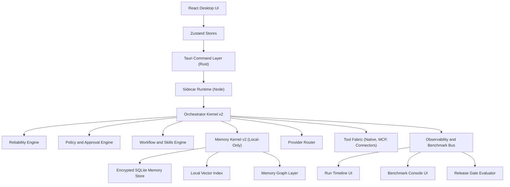
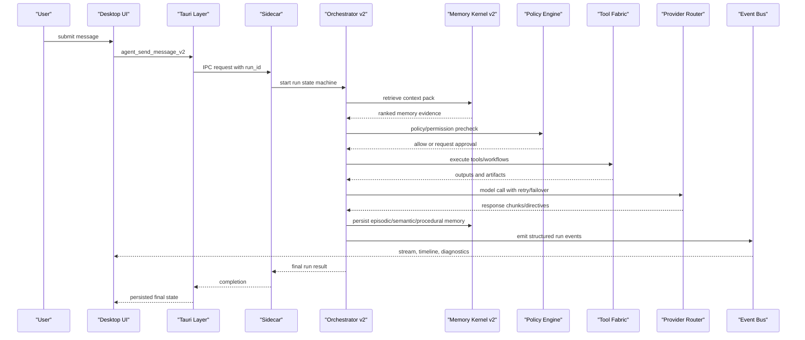
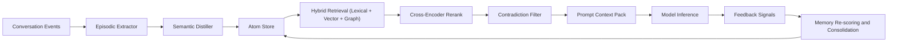

# ADR-001: Runtime Architecture and Flow Freeze

Date: 2026-02-12  
Status: Accepted (Frozen)

## Context

The launch branch requires a stable end-to-end architecture so all reliability, memory, policy, workflow, research, and benchmark workstreams can converge without interface drift.

## Decision

Freeze the target architecture as:

1. React desktop UI + Zustand stores for operator surfaces and durable client state.
2. Tauri command layer (Rust) as trusted transport and OS-security boundary.
3. Sidecar runtime (Node) as orchestration runtime for agent loops and tools.
4. Orchestrator v2 with reliability engine, policy engine, workflow/skills engine, memory kernel v2, provider router, and observability bus.
5. Local-only memory stack backed by encrypted SQLite + local vector index + memory graph edges.
6. Unified event bus powering run timeline, benchmark console, and release-gate evaluation.

No breaking architectural changes are allowed without release-gate exception.

## Frozen Topology

## Frozen Run Sequence

## Frozen Memory Loop

## Consequences

1. All command/type/event additions must remain backward compatible with the frozen contracts.
2. Delivery focus shifts from breadth to depth: reliability, correctness, safety, and usability.
3. Release gate can reject any change violating this ADR without exception approval.

## Verification

- Cross-reference contract freeze: `docs/5-5-launch/contracts/v2-contract-freeze.md`
- Architecture references now centralized in this ADR for design review and execution tracking.

